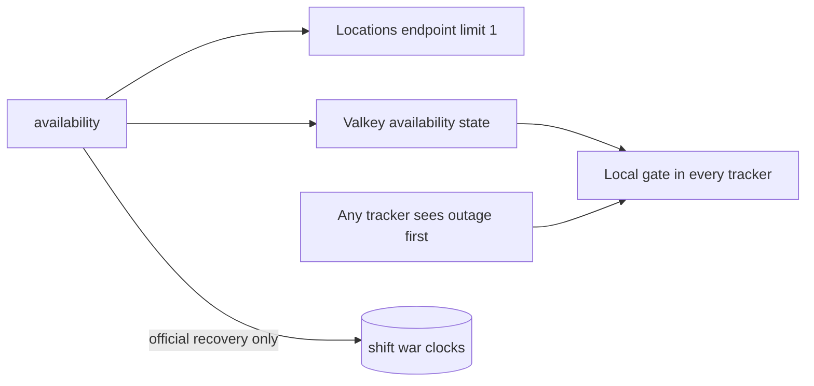

# API availability and maintenance (`availability`)

## What this process is for

Availability gives every separate tracker one shared answer to “should Clash requests run now?” It distinguishes official Clash maintenance, which changes war clocks, from a proxy/network outage, which does not.

## When it runs

One `availability` process probes every 15 seconds. Every Clash-using process also runs a lightweight local watcher for the shared Valkey state and owns a process-local request gate.

## Probe and classification flow

```text
GET locations?limit=1
  -> success: available
  -> typed/status 500 maintenance response with maintenance message: official maintenance
  -> gateway/proxy unavailable: proxy outage
```

The locations endpoint is intentionally tiny and historically more dependable than the Gold Pass endpoint.

## How trackers survive before the controller notices

Every request wrapper can observe an unavailable error. The first such response closes that process's local gate immediately. Later workers stop before starting their request instead of hundreds of goroutines retrying independently. The gate reopens only after it sees a newer healthy controller heartbeat.

## Shared Valkey state

The controller writes `tracking:clash_availability` with:

- whether requests are available;
- whether the outage is official maintenance;
- the time the current state began;
- a short 45-second key lifetime, refreshed by the controller.

There is no SQL maintenance ledger. Only the controller writes this state.

## Official maintenance recovery

The controller preserves the original outage start across failed probes. On recovery, it measures the duration and performs one SQL transaction:

```text
war_schedule.end_time      += duration
war_schedule.next_run_at   += duration
matching player_timers     += duration
matching war_reminder_jobs += duration
```

Preparation time and the canonical schedule key remain unchanged because they identify the same war. The healthy state is published after the shift succeeds.

## Proxy outage recovery

A proxy outage closes the same request gates but does not move game clocks. Once a healthy probe is newer than the local observation, requests resume where their paging loops paused.

## Interaction diagram



## Configuration

The 15-second probe interval and 45-second heartbeat TTL are code-level constants. The process requires the proxy/Clash client, Valkey, Timescale/PostgreSQL, and the event stream for the recovery event.

## Outages and restarts

If the controller restarts during an ordinary outage, request workers remain locally paused after observing errors until a new healthy heartbeat arrives. There is intentionally no durable maintenance history; the design accepts the unlikely controller restart during an official window instead of operating a ledger and application protocol.

## What it deliberately does not do

- No `maintenance_windows` table.
- No time shift for proxy downtime.
- No independent one-minute retry loop in every worker.
- No attempt to pause Valkey TTL clocks globally.
