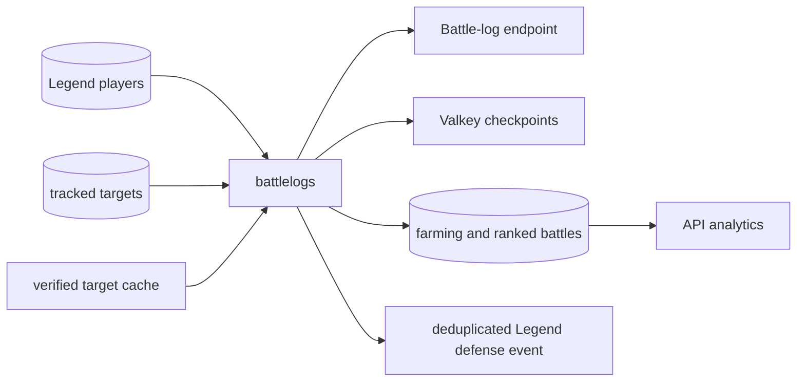

# Battle-log tracking (`battlelogs`)

## What this process is for

Battle-log tracking stores newly observed multiplayer battles for players whose history is worth polling. It also publishes a deduplicated mobile event for each newly observed Legend defense after the raw battle is durable.

## When it runs

It runs continuously as `battlelogs`. Two independent target loops share the total configured request budget:

- Legend targets use `battlelogs.priority_requests_per_second`.
- Standard tracked-player targets use the remaining `battlelogs.requests_per_second` budget.

Each group has its own progress statistics. Its target tags are loaded once per complete pass and kept as a small in-memory slice; this avoids re-expanding configured-clan member JSON for every page.

## How a player becomes a target

Legend targets are players whose stored league is Legend League. Standard SQL targets are Town Hall 9 or higher members of recently active configured server clans, matching `trackedplayers`. Active verified app accounts are selected from `player_links` when `last_login` is within seven days, without a Town Hall filter, and use the same standard request budget. Verified players already in Legend League are removed from the standard pool so the two workers cannot publish the same newly observed battle twice.

Bookmarks and war participation do not create battle-log targets. There is no `battlelogs_tracking_ttl`.

## Decision flow

```text
Load and deduplicate the current target set once
  -> split it into checkpoint batches
  -> load each batch's checkpoints with one Valkey MGET
  -> stream player jobs through the fixed worker pool
  -> GET the player's battle log
  -> keep entries newer than the durable timestamp checkpoint
  -> reject newly discovered rows older than the first-seen lookback
  -> insert new battles in SQL
  -> advance the checkpoint only after storage succeeds
```

Pseudocode:

```text
targets = configured-clan members UNION recently active verified player_links
for target_batch in targets:
  checkpoints = Valkey MGET for target_batch
  stream targets through bounded workers:
  log = GET /players/{tag}/battlelog
  checkpoint = checkpoints[target]
  for battle in log:
    if battle time is at or before the checkpoint: skip
    if no checkpoint and battle time is older than 14 days: skip
    keep farming attacks slim; store the requested player's Ranked/Legend perspective
    materialize each distinct Ranked or Legend army by normalized share code
    queue SQL insert
  commit inserts
  publish newly observed Legend defenses once
  save new checkpoint with its TTL
```

Checkpoint batches feed one long-lived pool rather than waiting for every retry at a batch boundary, so one slow 504 does not idle the rest of the request budget. Loading the roughly 100,000 current tags once per pass uses only a few megabytes and removes repeated JSON expansion from Postgres. The response-worker count, SQL batch, and pending-write queue are capped separately, which keeps the first-start history seed bounded. The 14-day rule applies only when deciding whether a battle is newly discoverable; the stored battle itself keeps its real API timestamp.

## Clash API used

- `GET /v1/players/{playerTag}/battlelog`.

## Data read and written

Reads target tables and the requested player's current Town Hall from `basic_player`. Farming attacks go to `battles_farming` with the player, time, result, duration, loot object, and share code; farming defenses and opponent metadata are discarded. The opponent Town Hall is zero-indexed in the wire response and is converted with `+1` exactly once during ingestion. Each Ranked or Legend response contributes only the requested player's own attack or defense perspective to `battles_ranked`. When both players are tracked, their separate responses supply the two perspectives without synthesizing either one. The database contract uses numeric `battle_mode` values `1` for Ranked and `2` for Legend, numeric `direction` values `1` for attack and `2` for defense, and `0` when duration is absent. Aggregate readers use only `direction=1`, so a battle observed from both players is counted once.

Ranked and Legend rows retain the normalized share code directly. The hot writer inserts each distinct code into `army_compositions`, keyed only by `share_code`; there is no army hash or parser-version identity. The daily Legend closeout reuses those compositions for family and item aggregation.

Hero mode segments such as `h2m1p16e5_41` are accepted and preserved in canonical share codes. Mode is not a composition column and does not participate in army-family similarity; `m0` and `m1` can remain distinct exact codes in the same family. The earlier rejection came from Tracking's share-code validator, not clashy.go.

The battle identity is `(player_tag, battle_time)`. Deploy this writer only with the final DevKit migration 017 contract. Existing raw rows remain intact.

The scheduled closeout rebuilds completed Legend-day and Ranked-season aggregates from raw attack perspectives. It groups newly observed Legend armies into immutable direct-anchor families and writes daily family outcomes. Farming and Ranked/Legend raw rows retain one year.

The Army Lab troop-overlap classifier remains a frozen candidate rather than a live replacement. Its import must first land in a forward schema migration with a durable model/version record, imported prototype IDs, and a separate versioned membership table; the existing `army_family_members` assignments and family IDs must remain unchanged. A later explicitly selected backfill can classify historical share codes into that new version and compare coverage/stability before an API cohort opts into it. This prevents a model import from silently reassigning the immutable IDs currently used by daily history.

Valkey checkpoint keys remember the newest battle time seen for each player. `battlelogs.checkpoint_ttl_days` controls their lifetime. The checkpoint is comparison state, not target membership.

Every target is fetched on every pass whether it has a checkpoint or not, so an empty or unchanged response does not cause an extra HTTP request on the next pass. Empty logs and logs with no entry newer than the current watermark emit no checkpoint. An incomplete newly observed Ranked or Legend entry also emits no checkpoint, because advancing a poll-time watermark could skip that battle if the API later returns the same battle timestamp with its missing opponent or army data filled in. Checkpoints therefore record the newest complete battle timestamp that was durably processed; they never record the time of the poll.

## Events and interaction

After SQL succeeds, each newly observed Legend defense publishes a `legend` stream entry whose value has `type=legend_defense`, `event_id`, normalized `player_tag`, and RFC3339-nanosecond `battle_time`. The event ID is deterministic for the player and battle time, and the Valkey append is atomically deduplicated. First-seen checkpoint seeding publishes no historical notifications. `trackedplayers` decides who belongs to the standard fast-player set; wars do not write player rows to opt people in.



## Configuration

- `battlelogs.requests_per_second`: total request-start budget.
- `battlelogs.priority_requests_per_second`: portion reserved for Legend targets.
- `battlelogs.checkpoint_ttl_days`: comparison-checkpoint retention.
- `battlelogs.first_seen_lookback_days`: `14` in the supplied config.
- `target_page_multiplier`, SQL, Valkey, and proxy settings.

## Outages and restarts

Requests pause at the availability gate. Storage ordering is SQL, then the atomically deduplicated event append, then the checkpoint. A failure at any stage replays safely without losing a notification or creating duplicate raw rows or stream events.

## What it deliberately does not do

- No bookmarked-player targeting or notifications.
- No writes to general `basic_player` targeting state.
- No stored trophy deltas or synthetic automatic defenses; API responses derive them from real results.
- No war-derived TTL.
- No search through every player's bookmarked accounts per attack.
