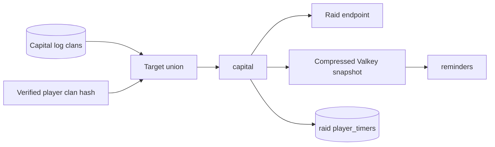

# Raid Weekend tracking (`capital`)

## What this process is for

Capital tracking keeps the current Raid Weekend snapshot for clans that need Capital logs or contain an actively tracked verified app account. It also records which players have actually participated.

## When it runs

The `capital` script polls only while Raid Weekend is active. Targets refresh every `capital.target_refresh_seconds`, and requests start at `capital.requests_per_second`.

## How a clan becomes a target

The target union is:

1. Clans with an enabled Capital log or related configured Capital consumer.
2. Current clan tags in the verified player-to-clan hash maintained by `trackedplayers`.

Many verified players in one clan collapse to one target. If one leaves, the clan remains while any other target still references it. The process compares the previous and new union on refresh.

## Decision flow

```text
Refresh target union
  -> removed target? delete only its compressed raid snapshot
  -> during weekend, GET latest raid season for each target
  -> no current weekend response? skip
  -> compare with previous compressed snapshot
  -> unchanged? make no SQL or cache write
  -> insert raid player_timers only for newly observed attackers
  -> publish Capital changes only when configured
  -> store compressed snapshot with six-hour safety TTL
```

Pseudocode:

```text
targets = configured_capital_clans UNION verified_player_current_clans
delete raid cache for old_targets - targets
if raid_weekend_active:
  for clan in targets:
    raid = GET /clans/{tag}/capitalraidseasons?limit=1
    if raid belongs to current weekend:
      new_members = raid.members - previous_raid.members
      insert missing player_timer(member.tag, 'raid', clan.tag, raid.end_time)
      if the clan has a configured Capital consumer and the snapshot changed:
        emit raid_update with nested raid and previous_raid objects
      cache gzip(raid), TTL 6 hours
```

## What participation means

The Clash API returns Raid Weekend members only after they attack. There is no zero-attack registration list. A raid `player_timers` row therefore means “this player was observed attacking here,” not “this player was a clan member when the weekend began.” Once observed, that timer remains until the event ends even if the clan later leaves the target union.

## Clash API used

- `GET /v1/clans/{clanTag}/capitalraidseasons?limit=1`.

## Data read and written

Reads server Capital configuration and the verified player-to-clan Valkey hash. Writes `player_timers` with `event_type = raid`, `event_key = clan tag`, and the API Raid Weekend end time. Existing rows are never rewritten: the end is fixed for the weekend, so each newly observed participant uses `ON CONFLICT DO NOTHING`.

Valkey stores a gzip-compressed latest raid response under `capital.snapshot_prefix`. An unchanged API response does not rewrite that payload; if its six-hour TTL eventually expires, the next poll repopulates it without emitting a false change. Removed targets are deleted immediately to prevent a stale response being reused if the clan returns. The TTL is a safety net for orphaned keys and maintenance periods, and next weekend always starts from a fresh comparison.

## Events and interaction

Configured Capital consumers receive one v2 `raid_update` containing nested `raid` and `previous_raid` objects whenever the snapshot changes. The consumer can calculate the exact state, member, or attack message from that pair without another cache or API read. Mobile and Discord Raid reminders read the cache first, then fetch on demand if it is missing. `trackedplayers` supplies current verified clans; `capital` never polls bookmarked players.



## Configuration

- `capital.requests_per_second`
- `capital.target_refresh_seconds`
- `capital.snapshot_prefix`
- SQL, Valkey, event stream, proxy, and concurrency settings

## Outages and restarts

Requests pause at the availability gate. Fixed Raid reminder intervals may be skipped during an outage; Raid clocks are not shifted because the weekend has one global schedule. The six-hour cache TTL is long enough to tolerate normal maintenance but short enough to avoid old ownership lingering.

## What it deliberately does not do

- It cannot create zero-attack participants.
- It does not retain a player-to-raid reverse cache; `player_timers` is the durable lookup.
- It does not keep a clan targeted after all reasons disappear.
- It does not create one future job row per Raid reminder.
