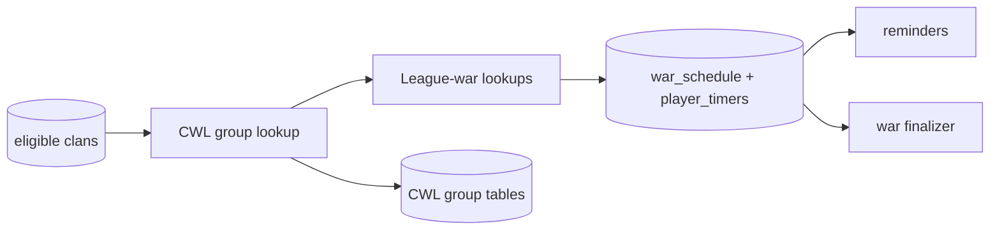

# Clan War League tracking (`cwl`)

## What this process is for

The CWL process discovers league groups, stores group membership and league metadata, and schedules every league war through the same durable war system used by regular wars.

## When it runs

It is a separate `cwl` script. It wakes every `wars.cwl_sync_seconds`. New group discovery runs from the 1st through the 3rd UTC because clans cannot sign up later; current-season groups already found keep syncing through the 15th or until their stored state becomes `ended`.

## How a clan becomes a target

Targets are known clans with public war logs and a stored CWL league ID. They are paged independently from the active/dormant regular-war cursors. During the 1st–3rd discovery window, clans with no current-season group are checked individually because their group is not known yet. As soon as one response stores all group members, those known siblings leave the discovery pool and SQL keeps only one eligible representative for that active group. An eight-clan group therefore uses one group refresh after discovery rather than eight.

The page is processed with bounded concurrent workers behind the shared 500-request/second limiter. Normal network latency therefore does not turn the global CWL crawl into a sequential 20–30 request/second loop.

## Decision flow

```text
Load CWL target page
  -> GET target's current league group
  -> wrong season/no group? skip
  -> derive stable group identity and deduplicate
  -> store group clans and members
  -> ask SQL which round war tags are already scheduled or permanent
  -> GET only previously unseen league wars by tag
  -> canonicalize and upsert war_schedule + player_timers
  -> retain observed war size and league ID on the group
```

Pseudocode:

```text
if current time is CWL:
  for target in page:
    group = GET /clans/{tag}/currentwar/leaguegroup
    if group season != current season: continue
    if group already seen: continue
    known = SQL war tags already in war_schedule or wars
    for unseen war_tag in group.rounds:
      war = GET /clanwarleagues/wars/{war_tag}
      schedule canonical war and participant timers
    upsert CWL group, league id, clans, members, rounds, and war size
```

## Clash API used

- Current league group for a clan.
- League war by war tag.

Both calls go through the configured proxy and availability gate.

## Data read and written

Reads CWL candidate clans and any stored league ID. Writes CWL group, group-clan, and group-member tables plus canonical `war_schedule` and `player_timers`. Final CWL attacks and permanent war data are stored later by the `war-discovery` due-schedule finalizer.

The group retains both `cwl_league_id` and observed `war_size`; neither has to be reconstructed from attack rows later. When a live configured-clan tracker scheduled the war first, this process derives the size from its participant timers instead of refetching the same tagged war. A later group response with no new tags preserves the already known size rather than replacing it with null.

## Events and interaction

New schedules publish `war_schedule`, allowing Discord/mobile war reminders to reconcile. Preparation and battle schedules are independent, so a reminder can be created for tomorrow's preparation while today's battle is still running. This process does not publish join/leave events. The regular live tracker ignores CWL responses so ownership is not split.



## Configuration

- `wars.cwl_sync_seconds`
- `wars.requests_per_second`
- `target_page_multiplier`
- SQL, event stream, and proxy settings

## Outages and restarts

API work pauses at the availability gate. Stored group/schedule identities make repeated passes idempotent. Scheduled end times receive the same official-maintenance shift as regular wars.

## What it deliberately does not do

- It does not use the regular war discovery cursor.
- It does not live-poll every CWL attack for Discord; `trackedclans` owns that configured-clan path and can hold both the ongoing and next-preparation war.
- It does not write `basic_player`.
- It does not finalize wars in memory.
