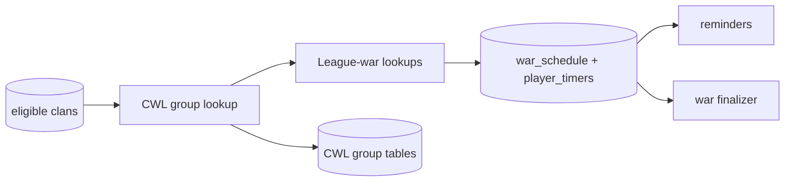

# Clan War League tracking (`cwl`)

## What this process is for

The CWL process discovers league groups, stores group membership and league metadata, and schedules every league war through the same durable war system used by regular wars.

## When it runs

It is a separate `cwl` script. It wakes every `cwl.sync_seconds`. New group discovery and current-season refreshes run from the 1st through the 15th UTC. Discovery stays open after signup closes so a new or restarted tracker can recover groups first observed mid-season. Stored groups stop refreshing when their state becomes `ended`.

## How a clan becomes a target

Every clan in `basic_clan` is eligible for CWL discovery, including clans with private war logs and no cached CWL league. CWL targets are paged independently from the active/dormant regular-war cursors, whose public-log and recent-war rules remain unchanged. During the 1st–15th discovery window, clans with no current-season group are checked individually because their group is not known yet. As soon as one response stores all group members, those known siblings leave the discovery pool and SQL keeps one representative for that active group.

The page is processed with bounded concurrent workers behind the configured discovery limiter, currently 250 requests per second. Once the current battle and following preparation war are both known, that group sleeps until the current battle ends. It then becomes eligible once, discovers the next preparation war, and sleeps again. If the following preparation war is not known yet, the group remains eligible so a late matchup is not missed.

## Decision flow

```text
Load CWL target page
  -> GET target's current league group
  -> wrong season/no group? skip
  -> derive stable group identity and deduplicate
  -> reuse the group's persisted league, or resolve it once if absent
  -> store group clans and members
  -> ask SQL which round war tags are already scheduled or permanent
  -> GET only previously unseen league wars by tag
  -> canonicalize and upsert war_schedule + player_timers
  -> retain observed war size and league ID on the group
```

Pseudocode:

```text
if current time is CWL:
  for target in page:
    group = GET /clans/{tag}/currentwar/leaguegroup
    if the first seven characters of the exact group season != current UTC month: continue
    if group already seen: continue
    known = SQL war tags already in war_schedule or wars
    for unseen war_tag in group.rounds:
      war = GET /clanwarleagues/wars/{war_tag}
      schedule canonical war and participant timers
    upsert CWL group, league id, clans, members, rounds, and war size
```

## Clash API used

- Current league group for a clan.
- Clan profile for the first discovery of an unresolved group when `cwl.resolve_league_from_clan_profile` is enabled.
- League war by war tag.

Both calls go through the configured proxy and availability gate.

## Data read and written

Reads CWL candidate clans and any stored league ID. Writes CWL group, group-clan, and group-member tables plus canonical `war_schedule` and `player_timers`. Final CWL attacks and permanent war data are stored later by the `war-discovery` due-schedule finalizer.

The group retains both `cwl_league_id` and observed `war_size`; neither has to be reconstructed from attack rows later. With profile resolution enabled, the first discovery of an unresolved group fetches one representative clan profile and persists its current `warLeague`. Later refreshes and process restarts reuse that stored value, so the other group members and each refresh do not cause profile lookups. The profile field is a current observation rather than historical proof; persisting the first ranked observation prevents a later season's league from rewriting the stored group. A failed or unranked profile lookup leaves the league unresolved, still stores the group and retrievable wars, and retries on a later refresh. With the switch disabled, resolution uses the existing ranked consensus from `basic_clan`.

When a live configured-clan tracker scheduled the war first, this process derives the size from its participant timers instead of refetching the same tagged war. A later group response with no new tags preserves the already known size rather than replacing it with null.

The `scheduled` process derives `cwl_season_statistics` from these PostgreSQL group tables once a week for the current and previous UTC month. The aggregate is intentionally partial and has no finalized marker; an all-season run-once command can reconcile every retained season without reading R2 or changing any war producer.

## Events and interaction

New schedules publish `war_schedule`, allowing Discord/mobile war reminders to reconcile. Preparation and battle schedules are independent, so a reminder can be created for tomorrow's preparation while today's battle is still running. This process does not publish join/leave events. The regular live tracker ignores CWL responses so ownership is not split.



## Configuration

- `cwl.sync_seconds`
- `cwl.requests_per_second` for league-group discovery
- `cwl.resolve_league_from_clan_profile` enables the one-time profile resolution for groups without a persisted league; it defaults to `false`, while the checked deployment config enables it for the initial stale-cache rollout
- `cwl.war_requests_per_second` for war-tag hydration; when omitted, it inherits the group rate
- `target_page_multiplier`
- SQL, event stream, and proxy settings

Operational metrics use `cwl.groups` for the finite candidate pass. The eligible target total is recounted every 15 minutes, every attempted candidate advances progress, and group and optional profile requests share the configured 250-request/second limiter and its metrics. Previously unseen league-war requests use the separate configured 1,000-request/second budget. Outside the CWL calendar window the process remains idle rather than reporting fake target progress.

## Outages and restarts

API work pauses at the availability gate. Stored group/schedule identities make repeated passes idempotent. Scheduled end times receive the same official-maintenance shift as regular wars.

## What it deliberately does not do

- It does not use the regular war discovery cursor.
- It does not live-poll every CWL attack for Discord; `trackedclans` owns that configured-clan path and can hold both the ongoing and next-preparation war.
- It does not write `basic_player`.
- It does not finalize wars in memory.
