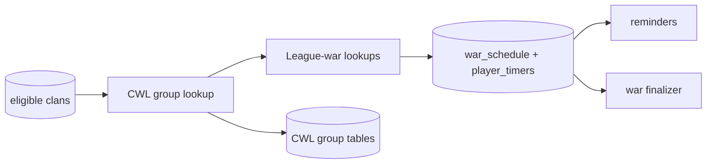

# Clan War League tracking (`cwl`)

## What this process is for

The CWL process discovers league groups, stores group membership and league metadata, and schedules every league war through the same durable war system used by regular wars.

## When it runs

It is a separate `cwl` script. It wakes every `wars.cwl_sync_seconds`, but calls the league endpoints only while the current date is inside the CWL window.

## How a clan becomes a target

Targets are known clans with public war logs and a stored CWL league ID. They are paged independently from the active/dormant regular-war cursors. Once one clan reveals a group, every clan tag in that group is marked covered for the current pass so the same group is not fetched repeatedly.

## Decision flow

```text
Load CWL target page
  -> GET target's current league group
  -> wrong season/no group? skip
  -> derive stable group identity and deduplicate
  -> store group clans and members
  -> for each round war tag, GET league war
  -> canonicalize and upsert war_schedule + player_timers
  -> retain observed war size and league ID on the group
```

Pseudocode:

```text
if current time is CWL:
  for target in page:
    group = GET /clans/{tag}/currentwar/leaguegroup
    if group season != current season: continue
    if group already seen: continue
    for war_tag in group.rounds:
      war = GET /clanwarleagues/wars/{war_tag}
      schedule canonical war and participant timers
    upsert CWL group, league id, clans, members, rounds, and war size
```

## Clash API used

- Current league group for a clan.
- League war by war tag.

Both calls go through the configured proxy and availability gate.

## Data read and written

Reads CWL candidate clans and any stored league ID. Writes CWL group, group-clan, and group-member tables plus canonical `war_schedule` and `player_timers`. Final CWL attacks and permanent war data are stored later by the `war-discovery` due-schedule finalizer.

The group retains both `cwl_league_id` and observed `war_size`; neither has to be reconstructed from attack rows later.

## Events and interaction

New schedules publish `war_schedule`, allowing Discord/mobile war reminders to reconcile. This process does not publish join/leave events. The regular live tracker ignores CWL responses so ownership is not split.



## Configuration

- `wars.cwl_sync_seconds`
- `wars.requests_per_second`
- `target_page_multiplier`
- SQL, event stream, and proxy settings

## Outages and restarts

API work pauses at the availability gate. Stored group/schedule identities make repeated passes idempotent. Scheduled end times receive the same official-maintenance shift as regular wars.

## What it deliberately does not do

- It does not use the regular war discovery cursor.
- It does not live-poll every CWL attack for Discord.
- It does not write `basic_player`.
- It does not finalize wars in memory.
