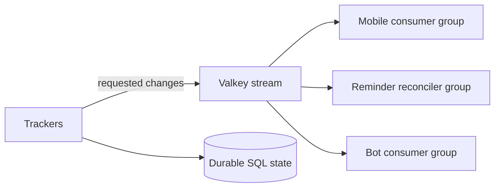

# Event transport (`events`)

## What this process is for

The event system carries requested live changes between independently running trackers and consumers. It is transport, not the durable source of game state.

## Event shape

Every published entry has a topic, optional clan tag, timestamp, and JSON value. Topics identify broad consumers such as `clan`, `war`, `war_schedule`, `capital`, `reminder`, `reminder_config`, and maintenance recovery.

## Publishing decision

Trackers should answer “does anybody consume this class of event?” before publishing. `trackedclans` keeps this interest in its batched in-memory target registry. Global clan tracking never publishes joins/leaves, and reminder-only war targets do not publish attack/state events.

## Consumer flow

```text
Create/reuse consumer group
  -> read new entries
  -> decode supported topic
  -> perform consumer-specific work
  -> acknowledge only after successful handling
  -> reclaim entries left pending longer than configured idle time
```

Different consumers have separate groups, so mobile delivery, reminder reconciliation, and bot delivery do not steal entries from one another.

## Durable state boundaries

The stream does not replace:

- `war_schedule` or `war_reminder_jobs` for clocks;
- `player_timers` for event participation;
- notification delivery tables for retries;
- roster automation execution rows;
- permanent war, clan, player, or battle data.

If a change must survive stream trimming independently, it belongs in SQL first and the event is published after commit.

## Valkey configuration

- `events.stream`
- `events.group`
- `events.consumer`
- `events.retention_seconds`
- `events.batch_size`
- `events.reclaim_idle_seconds`

## Interaction diagram



## Outages and restarts

Pending entries remain associated with their group until acknowledged or reclaimed. Stream retention bounds transport history, which is safe because canonical state is in SQL/cache snapshots and configuration events can be reconciled from the database.

## What it deliberately does not do

- It is not Kafka and does not pretend to be the database.
- It does not broadcast every observed API field difference.
- It does not determine recipients itself.
