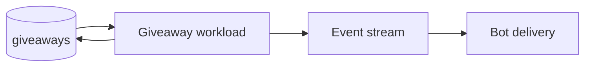

# Giveaway automation (inside `bot-automations`)

## What this workload is for

The giveaway workload finds giveaways whose stored deadline/state now requires action and publishes the corresponding bot work. It is a database schedule, not Clash API tracking.

## When it runs

It scans every `giveaways.scan_seconds` inside the shared `bot-automations` process.

## How a giveaway becomes a target

Targets are durable giveaway rows that are active and due according to their stored end time/status. Completed or cancelled giveaways are excluded by the SQL query rather than loaded and discarded one at a time.

## Decision flow

```text
Load due active giveaways
  -> verify current durable state
  -> choose/prepare completion work
  -> update giveaway state
  -> publish bot delivery event
```

The state transition and handoff are ordered so a restart cannot repeatedly treat an already completed giveaway as newly due.

## Data and services

Reads and writes the PostgreSQL giveaway tables. It does not call the Clash API. It publishes through the shared event stream; the bot performs Discord edits/messages.

## Interaction



## Configuration

- `giveaways.scan_seconds`
- SQL and event-stream settings

## Failures and restarts

The next scan naturally retries work that did not reach a completed durable state. Unexpected child failure stops the composite runtime so supervision restarts the full lightweight group cleanly.

## What it deliberately does not do

- It does not poll Clash or Reddit.
- It does not deliver Discord messages itself.
- It does not create a general-purpose scheduler.
