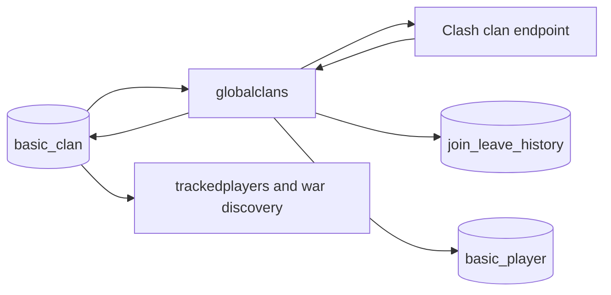

# Global clan tracking (`globalclans`)

## What this process is for

Global clan tracking keeps the broad `basic_clan` catalogue current. It is the durable owner of clan profile data, the current member list, and membership history. It does not decide whether Discord should receive a join or leave message.

## When it runs

It runs continuously as the `globalclans` script. Two loops run at the same time:

- The priority loop handles clans considered active and uses `globalclans.priority_requests_per_second`.
- The non-priority loop handles the remaining clans and uses `globalclans.non_priority_requests_per_second`.

Each loop has its own cursor. A large inactive population therefore cannot stop active clans from being revisited.
The two configured rates are a shared proxy load. Request starts are spaced evenly instead of being released in one-second bursts. `write_workers` controls tag-sharded SQL writers, so first-time player hydration can use database concurrency without allowing two workers to update the same clan concurrently.
Clan requests flow continuously rather than waiting for every request in a SQL page to finish. A request that still returns a gateway timeout, truncated response, or rate-limit response after its bounded retries is left in the target table and tried again on the next full scan. This keeps one unusually slow or briefly throttled clan from pausing thousands of unrelated clans.

## How a clan becomes a target

Targets come from `basic_clan`. The database query assigns each clan to exactly one pool using its stored activity state. Pages are ordered by clan tag and resume after the last tag read. `target_page_multiplier` controls how many seconds of work are loaded in one page.

## Decision flow

```text
Load next target page
  -> request the current clan
  -> request failed permanently? record the failure or remove an invalid clan
  -> response unchanged? only refresh tracking state that needs refreshing
  -> response changed? update the clan and compare member tags
  -> store profile changes, joins, leaves, records, and discovered players
```

Pseudocode:

```text
for each target pool:
  page = load_clans_after(cursor)
  for clan_tag in page, at the pool rate:
    clan = GET /clans/{clan_tag}
    previous = load basic_clan
    changes = compare(previous, clan)
    write current clan and durable history in one batch
  advance or wrap cursor
```

## Clash API used

- `GET /v1/clans/{clanTag}` through the configured ClashKing proxy.

No current-war, CWL, player-profile, battle-log, or Raid Weekend endpoint is called here.

## Data read and written

Reads:

- `basic_clan` for targets and the previous snapshot.
- Tracking cursor/state tables used by the paging framework.

Writes:

- `basic_clan`: current profile, public-war-log flag, members, activity fields, and known Clash IDs.
- `clan_records`: best clan points and war streak records.
- `basic_player`: inexpensive member facts learned from the clan response.
- `join_leave_history`: durable join and leave rows.
- `clan_change_history`: durable description, level, league, and other supported profile changes.

Only columns whose incoming values are different are updated. This reduces database writes when a clan response is unchanged.
Member summaries are copied into a connection-local temporary staging table before the set-based `basic_player` upsert. The table clears at transaction commit and is reused by that database connection, avoiding one temporary-table create/drop cycle for every write batch.

An imported clan can already have `member_count` without having its first `members` snapshot. The empty snapshot is treated as first hydration: the current members seed `basic_clan` and `basic_player`, but they are not recorded as joins and do not promote the clan into priority tracking. Join/leave comparison starts with the following successful poll.

## Valkey and events

Global clan tracking does not publish join or leave events. That is intentional: it tracks millions of clans, while only a small configured subset has a live consumer. `trackedclans` owns live event emission.

It uses the shared availability gate but has no clan-specific Valkey cache.

## Interaction with other processes



`trackedplayers` can use the stored member lists of recently active server clans. War discovery uses `public_war_log` and `last_war_at`. Live clan tracking may observe the same clan more often, but it does not replace this process as the durable global owner.

## Configuration

- `globalclans.priority_requests_per_second`
- `globalclans.non_priority_requests_per_second`
- `globalclans.write_workers`
- `target_page_multiplier`
- Timescale/PostgreSQL connection settings
- Proxy origin and credentials shared by all Clash callers

## Outages and restarts

Every request waits at the shared availability gate. A proxy outage pauses without changing game time. Official Clash maintenance also pauses; this process needs no clock shifting because clan snapshots have no scheduled end time. A process restart begins each ordered target pool from the first tag again; unchanged-row checks make that safe, though a future durable cursor could avoid the repeated prefix.

## What it deliberately does not do

- It never publishes join/leave messages.
- It does not poll wars, CWL, Raid Weekend, battle logs, or full player profiles.
- It does not own notification configuration.
- It does not infer live event interest per response.
