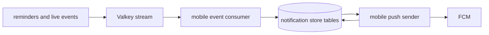

# Notification processing (`notifications`)

## What this runtime is for

`notifications` is one process that runs two small components together: the event-to-mobile-post consumer and the mobile push sender. They remain separate Go files because decoding events, storing delivery work, and calling FCM are different responsibilities.

## The notification store

`mobile_push_store.go` is a Go SQL persistence layer, not another worker and not another database. It centralizes operations for:

- registering/loading enabled devices;
- storing posts or campaigns that need delivery;
- loading due attempts;
- recording success/failure;
- updating retry state and disabling invalid tokens;
- preventing the same logical reminder from being delivered repeatedly.

This keeps SQL mechanics out of event decoding and FCM transport code.

## Event-consumer flow

```text
Read Valkey consumer group
  -> event is not a supported mobile type? acknowledge and ignore
  -> war reminder? resolve participating verified accounts and group by user
  -> raid_mobile reminder? use supplied user and remaining attacks
  -> build one logical notification post
  -> store delivery work
  -> acknowledge stream entry after processing succeeds
```

Mobile accounts are verified accounts only. Bookmarked-player and Legend notification paths do not exist.

## Sender flow

```text
Load due delivery attempts
  -> decrypt/load device token
  -> send through FCM
  -> success: record delivered
  -> retryable error: move next attempt forward
  -> invalid token/disabled device: stop future delivery to that device
```

FCM is the only provider; Android and iOS both use it. Provider is still stored explicitly so rows and transport behavior are unambiguous.

## War and Raid grouping

For war reminders, every verified account belonging to one user and the same war is combined. Five accounts do not create five pushes; remaining attacks are totalled into one message.

For Raid Weekend, the reminder producer has already grouped the user's verified accounts by current clan and supplied the remaining total. A player that has not attacked may reasonably count as having the base attack allowance because the Clash raid response has no zero-attack roster.

## Data and services used

Consumes the configured Valkey event stream. Reads mobile account/device configuration and war participation data as required. Writes mobile posts/campaigns, delivery attempts, retry times, and logical delivery keys. Calls Firebase Cloud Messaging; it never sends a Discord webhook.

## Interaction diagram



Discord reminders can share the same underlying clock and war fetch, but remain distinct recipient references because channels, threads, custom text, filters, roles, and webhooks can differ by server. The bot owns that delivery and is outside this process.

## Configuration

- `mobile_push.scan_seconds`
- FCM service-account/project settings
- Data-encryption key for tokens
- Event stream/group/consumer/reclaim settings
- Timescale/PostgreSQL and Valkey settings

## Outages and restarts

The consumer group retains unacknowledged entries and can reclaim them after the configured idle period. SQL delivery attempts survive restart. FCM retry behavior is stored rather than held only in memory.

## What it deliberately does not do

- No mobile Legend or bookmarked-player notifications.
- No direct war/raid polling.
- No Discord delivery.
- No separate container for each small notification source file.
