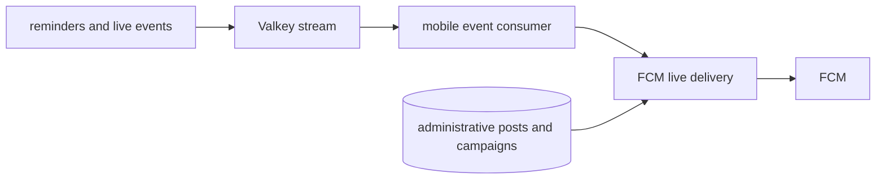

# Notification processing (`notifications`)

## What this runtime is for

`notifications` is one process that runs two small components together: the live-event mobile consumer and the administrative post/campaign sender. They remain separate Go files because decoding live events, storing administrative sends, and calling FCM are different responsibilities.

## The notification store

`mobile_push_store.go` is a Go SQL persistence layer, not another worker and not another database. It centralizes operations for:

- registering/loading enabled devices;
- storing posts or campaigns that need delivery;
- loading due attempts;
- recording success/failure;
- updating retry state and disabling invalid tokens;
- preventing the same logical reminder from being delivered repeatedly.

This keeps SQL mechanics out of event decoding and FCM transport code.

## Event-consumer flow

```text
Read Valkey consumer group
  -> event is not a supported mobile type? acknowledge and ignore
  -> war reminder? resolve participating verified accounts and group by user
  -> raid_mobile reminder? use supplied user and remaining attacks
  -> legend_defense? resolve the verified player account and enabled preference
  -> send the supported live event through FCM
  -> acknowledge stream entry after processing succeeds
```

Mobile accounts are verified accounts only. Legend defenses require an enabled account, `mobile_notification_preferences.legend_defenses_enabled`, and an enabled FCM device. Bookmark state is not a recipient source.

War reminder events use a single v2 representation: `data` must be a nested war object and `minutes_remaining` must be a positive integer. Stringified JSON and formatted-hour compatibility fields are deliberately rejected so producers and consumers cannot silently disagree about the contract.

## Sender flow

```text
Load due delivery attempts
  -> decrypt/load device token
  -> send through FCM
  -> success: record delivered
  -> retryable error: move next attempt forward
  -> invalid token/disabled device: stop future delivery to that device
```

FCM is the only provider; Android and iOS both use it. Provider is still stored explicitly so rows and transport behavior are unambiguous.

## War and Raid grouping

For war reminders, every verified account belonging to one user and the same war is combined. Five accounts do not create five pushes; remaining attacks are totalled into one message.

An overlapping CWL preparation event is not treated as a live “war started” mobile push. Its schedule can still produce the user's configured future reminders, while live start/score/end preferences apply only to the battle-role war.

For Raid Weekend, the reminder producer has already grouped the user's verified accounts by current clan and supplied the remaining total. A player that has not attacked may reasonably count as having the base attack allowance because the Clash raid response has no zero-attack roster.

## Data and services used

Consumes the configured Valkey event stream. Reads mobile account, preference, device, and war participation data as required. Administrative sends use posts, campaigns, and their delivery-attempt tables; live events are retried through unacknowledged stream entries. Calls Firebase Cloud Messaging; it never sends a Discord webhook.

The event consumer reports `mobilepush.events` active-batch depth, processing duration, and readiness. The scheduled delivery worker reports its existing `mobilepush` run and write metrics; neither uses target progress because both consume ongoing work.

## Interaction diagram



Discord reminders share the same underlying clock and war fetch, but remain distinct recipient references because channels, threads, custom text, filters, roles, and webhooks can differ by server. The separate `discord-delivery` process owns that delivery.

## Configuration

- `mobile_push.scan_seconds`
- FCM service-account/project settings
- Data-encryption key for tokens
- Event stream/group/consumer/reclaim settings
- Timescale/PostgreSQL and Valkey settings

## Outages and restarts

The consumer group retains unacknowledged live events and can reclaim them after the configured idle period. Administrative post and campaign delivery attempts survive restart in SQL.

## What it deliberately does not do

- No bookmarked-player notifications.
- No direct war/raid polling.
- No Discord delivery.
- No separate container for each small notification source file.
