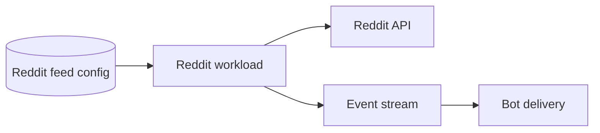

# Reddit feed automation (inside `bot-automations`)

## What this workload is for

The Reddit workload polls configured subreddits or feeds and hands newly observed posts to the bot delivery path. It is light enough to share the `bot-automations` process but owns its own polling and deduplication state.

## When it runs

It wakes every `reddit.poll_seconds`. If credentials or required configuration are unavailable, startup/readiness reports the problem rather than silently producing empty feed results.

## How a feed becomes a target

Targets come from enabled Reddit feed configuration stored for servers. Disabled or incomplete feeds are not polled. Target configuration determines the subreddit/feed and downstream Discord destination; the tracker does not invent destinations from Reddit data.

## Decision flow

```text
Load enabled feeds
  -> request recent Reddit posts
  -> compare post IDs with durable/remembered state
  -> no unseen post? advance normally
  -> unseen post? publish normalized bot work and remember its ID
```

## External endpoint and data

Calls Reddit using `REDDIT_CLIENT_ID`, `REDDIT_CLIENT_SECRET`, `REDDIT_USERNAME`, and `REDDIT_PASSWORD`. It reads feed configuration and writes the state needed to avoid repeating the same post. Bot-facing work uses the shared event transport.

## Interaction



## Configuration

- `reddit.poll_seconds`
- Reddit credentials from environment variables
- SQL/Valkey and event stream settings

## Failures and restarts

A failed poll is recorded and retried on the next interval. Deduplication state prevents a normal restart from treating every visible post as new.

## What it deliberately does not do

- It does not send Discord webhooks itself.
- It does not share target state with giveaways or rosters.
- It does not justify a separate container.
