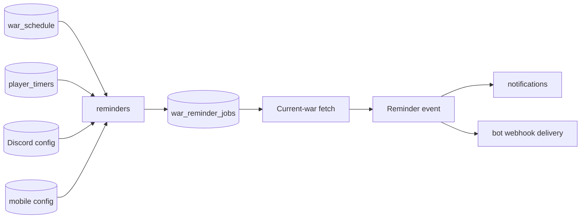

# Reminder scheduling (`reminders`)

## What this process is for

The reminder process owns clock decisions: which future war offsets must exist, when a shared clock is due, and when fixed-calendar Capital, Clan Games, and inactivity checks should run. It publishes delivery-ready events but does not send FCM or Discord webhooks itself.

## Work running inside this process

Five loops run together:

1. Valkey event consumption for new war schedules and Discord configuration changes.
2. Due war-job checks every 15 seconds.
3. Mobile war reconciliation every five minutes.
4. Raid Weekend checks on quarter-hour boundaries.
5. Clan Games and inactivity checks on quarter-hour boundaries.

At startup, every active `war_schedule` is reconciled once.

## War reminder model

One `war_reminder_jobs` row represents a clock, not a recipient:

```text
(schedule_key, minutes_remaining, run_at)
```

If three Discord servers and two mobile users all request 60 minutes remaining for the same war, they share one row and one current-war fetch. Recipient configuration is resolved when the clock fires.

## How war jobs are created and changed

```text
New war_schedule event
  -> load Discord offsets for either clan
  -> load enabled verified mobile offsets for participating player_timers
  -> insert/update every required future clock
  -> delete clocks no recipient still requests
```

Discord reconciliation is event-driven on new war, config create/update/delete, and startup. This allows a reminder added during a running war to take effect immediately without a permanent five-minute Discord scan. Mobile preferences have a five-minute safety reconciliation because device/app configuration can change through a different path.

An event is acknowledged only after its SQL reconciliation succeeds. If the process fails during that work, restart-time reconciliation rebuilds all active clocks from durable configuration and `war_schedule`, so a transient failure cannot turn into a permanently stale Discord reminder. Removal also applies the reminder's war-type filter, preventing a normal-war-only configuration from preserving a stale CWL clock or vice versa.

## When a war clock fires

```text
Load due clock
  -> wait for availability
  -> recheck SQL: maintenance may have moved run_at
  -> GET current war once
  -> still active and usable? publish one reminder event
  -> delete the clock
```

The event uses one v2 contract: `minutes_remaining` is an integer and `data` is the current war object. It does not duplicate the offset as a formatted legacy string. The notification consumer groups all of one user's participating verified accounts and totals their remaining attacks. The intended mobile text is `45 minutes & 7 attacks left in war!`.

## Raid Weekend reminders

Raid Weekend ends at the same time for everyone, so there are no individual future rows. On each quarter-hour during the weekend, the process selects Discord/mobile preferences whose configured remaining minutes equal the current remaining minutes. It uses the compressed Capital cache first, falls back to the raid endpoint, totals mobile attacks per user and clan, and publishes only when attacks remain.

Discord member reminders use one v2 shape: `clan` is the current clan, `reminder` is a typed configuration built from SQL columns, and `members` is the filtered list that still needs the reminder. Raid reminders additionally include the current response as `raid`. Old `_data` names, Mongo-style `_id`, and opaque `reminder.data` blobs are not published.

## Clan Games and inactivity reminders

Clan Games checks run only from the 22nd through the 28th. They combine current clan members with positive `clan_games` deltas observed since the event began, then apply threshold, town hall, and role filters.

Inactivity checks find members as their most recent `player_online_events` time crosses the configured threshold. A 15-minute window prevents the same crossing from being selected on every quarter-hour forever. Current clan data supplies accurate role/town hall filtering before publication.

## Clash API used

- Current regular war by clan tag.
- CWL war by war tag.
- Latest Capital raid season with `limit=1` when cache is unavailable.
- Current clan for Discord role/town hall enrichment.

## Data and Valkey used

Reads `war_schedule`, `player_timers`, `reminders`, verified `mobile_notification_accounts`, `mobile_push_devices`, `basic_clan.members`, `player_stat_changes`, and `player_online_events`. Writes only `war_reminder_jobs` and deletes a job after it fires.

Consumes `war_schedule` and `reminder_config` events from its own Valkey consumer group. Publishes `reminder` events containing the shared current snapshot and enough identity for downstream recipients.

## Interaction diagram



## Configuration

There is no generic job-framework config. War mobile reconciliation is five minutes; due-job and availability-sensitive clocks are hard-coded to 15 seconds; fixed event granularity is 15 minutes. It also uses event-stream, SQL, Valkey, proxy, and `capital.snapshot_prefix` settings.

## Outages and restarts

War jobs survive restarts in SQL. Official maintenance shifts the schedule, player timers, and reminder clocks in one transaction; after the gate opens, the process rechecks `run_at` before sending. Proxy-only downtime pauses without shifting. Delivery failure can be missed by design, while final-war persistence has stronger retries.

## What it deliberately does not do

- It does not send webhooks or FCM directly.
- It does not create per-recipient Raid/Clan Games/inactivity jobs.
- It does not continuously scan Discord war configuration every five minutes.
- It does not maintain an in-memory copy of all future jobs.
