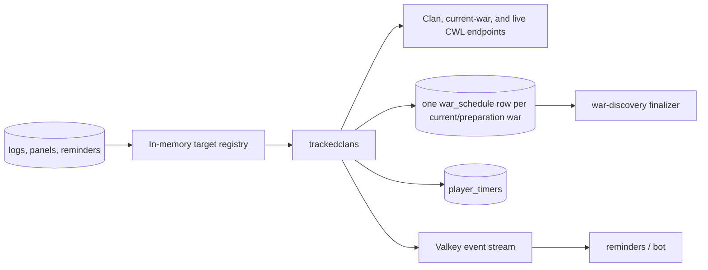

# Live clan and war tracking (`trackedclans`)

## What this process is for

`trackedclans` provides fast polling only where a configured Discord feature needs live clan or war behavior. It keeps live comparison snapshots and publishes requested events. It does not replace `globalclans` as the durable owner of the global clan/member tables.

## When it runs

It runs continuously as `trackedclans`. A clan loop, a regular current-war loop, and a live CWL loop share the `trackedclans.requests_per_second` limiter. The target registry is reloaded every `trackedclans.target_refresh_seconds`; the CWL loop wakes every `wars.cwl_sync_seconds` and only calls CWL endpoints for a current active season.

## How a clan becomes a target

The registry is built in one SQL query from active-server configuration:

- Join or leave logs enable clan polling and member events.
- War logs or war panels enable war polling and live war events.
- Discord war reminders enable war polling so a new war can be scheduled, but do not by themselves enable attack/state event publication.

Servers must have used ClashKing within 90 days, configuration must be enabled, and clan tags must be present. The result is kept in memory, so each API response does not perform an interest lookup.

## Clan decision flow

```text
Target has join/leave interest
  -> GET current clan
  -> compare with the prior live Valkey snapshot
  -> publish member_join and member_leave only for actual tag differences
  -> replace the live snapshot
```

These events are delivery signals. Durable `basic_clan` and `join_leave_history` writes remain the responsibility of `globalclans`.

## War decision flow

```text
Target has a war feature
  -> GET current war
  -> ignore CWL responses in this regular-war loop; the live CWL loop handles them
  -> compute key from sorted clan tags + preparation time
  -> upsert war_schedule and all participating player_timers
  -> publish war_schedule so reminders reconcile immediately
  -> if war log/panel interest exists, compare snapshot and emit requested changes
```

Pseudocode:

```text
war = GET /clans/{tag}/currentwar
if war is usable and not CWL:
  key = canonical_key(war.clan, war.opponent, war.preparation_start)
  transaction:
    upsert one war_schedule row
    upsert one timer per participating player
  publish war_schedule(key)
  if registry says publish_live_war_events:
    emit new_war, new_attacks, or war_state when comparison requires it
store current live snapshot
```

For CWL, the live loop keeps explicit `battle` and `preparation` slots because a clan can have today's battle running while tomorrow's lineup is already in preparation. Each slot has its own war-tag snapshot, durable `war_schedule` row, participant timers, and reminders. A preparation war is never mislabeled as current just because it is round one. The entire 3rd remains a discovery day; a clan is marked as not participating only after that window closes.

A clan with no current group is checked at most every 15 minutes during signup. Once a group exists but has not exposed its first war tags, it stays on the faster CWL loop so reminders are scheduled promptly. After tags are known, the tracker calls those tagged-war endpoints directly, refreshes the group only every 15 minutes or on a round transition, and shares each war-tag response across both participating tracked clans for the cycle.

Every CWL event includes `war_type: "cwl"`, `war_role`, `war_tag`, and `panel_target`. The one Discord panel follows events where `panel_target` is true: the ongoing battle wins, round-one preparation is eligible only while no battle exists, and preparation becomes the panel target when it enters `inWar`. The overlapping preparation war still emits `new_war` and `cwl_lineup_change` events with `panel_target: false`, allowing reminder and lineup consumers to act without replacing the battle panel. The separate `cwl` process remains responsible for the global durable group/member snapshot.

## Clash API used

- `GET /v1/clans/{clanTag}` for live member comparison.
- `GET /v1/clans/{clanTag}/currentwar` for regular/friendly war tracking.
- Current CWL league group and CWL war-tag endpoints for configured-clan live tracking.

## Data read and written

Reads `server_logs`, `reminders`, and server activity to build the registry. Live war discovery writes `war_schedule` and `player_timers`. Live comparison snapshots are held under `trackedclans.snapshot_prefix` in Valkey.

It does not write `basic_player`. It does not perform the global durable clan/member upsert.

## Events published

- `clan`: `member_join` and `member_leave` for configured consumers.
- `war_schedule`: a canonical war became available or was refreshed.
- `war`: live `new_war`, `new_attacks`, and `war_state` only when a war log/panel consumer exists.
- `war`: CWL battle attack/state changes plus preparation discovery and lineup changes. Explicit `war_role` and `panel_target` fields make the single-panel choice deterministic.

These are v2-only contracts. Current objects are nested under `clan`, `war`, or `raid`; previous values use `previous_war` or `previous_raid`. JSON is never placed inside a string, and no duplicate legacy field names are published.

## Interaction with other processes



Both live and global discovery may see the same war. Their canonical key makes the SQL upsert idempotent, and the discovery queries exclude clans already represented by a schedule.

## Configuration

- `trackedclans.requests_per_second`
- `trackedclans.target_refresh_seconds`
- `trackedclans.snapshot_prefix`
- Event stream, SQL, Valkey, proxy, and `target_page_multiplier` settings

## Outages and restarts

Requests pause at the shared gate. The SQL schedule survives restarts. Valkey live snapshots may be absent after eviction; the first response then becomes a baseline rather than generating a false burst of joins, leaves, or attacks.

## What it deliberately does not do

- No global clan/member persistence.
- No join/leave event from the global crawler.
- No Capital loop; the separate `capital` process owns Raid Weekend polling.
- No global CWL group/member persistence; the separate `cwl` process owns that durable snapshot.
- No per-response SQL/Valkey interest lookup.
- No in-memory future reminder scheduler.
