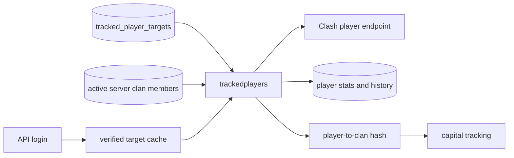

# Priority player tracking (`trackedplayers`)

## What this process is for

Priority player tracking keeps a smaller useful set of players fresh, detects meaningful changes, stores positive stat deltas, and records whether any activity was observed during a poll.

## When it runs

It runs continuously as `trackedplayers` at `trackedplayers.requests_per_second`. SQL targets are paged first. At the end of a full SQL pass, active verified-app targets from Valkey are polled in batches.

## How a player becomes a target

The target union is:

1. Enabled rows in `tracked_player_targets`. These are explicit, durable feature-owned requests.
2. Members stored on server clans whose server used ClashKing within 90 days.
3. Verified app accounts in the `tracking:verified_players` sorted set whose seven-day expiry has not passed.

The union is deduplicated. Bookmarked players are not targets merely because they are bookmarked.

## Decision flow

```text
Load target
  -> GET current player
  -> load previous compressed snapshot from Valkey
  -> first snapshot? establish baseline without inventing deltas
  -> compare current and previous
     -> update changed basic profile columns
     -> store supported profile history
     -> store positive stat deltas
     -> if any activity signal changed, write one online event
     -> if current clan changed, update/remove the player->clan hash entry
  -> replace snapshot only after SQL succeeds
```

Pseudocode:

```text
player = GET /players/{tag}
previous = Valkey GET player snapshot
if previous exists:
  changes = compare(previous, player)
  stats = positive_deltas(previous, player)
  activity_detected = any_activity_signal_changed(previous, player)
  transaction:
    upsert changed basic_player columns
    insert profile changes
    insert positive stat changes
    if activity_detected: insert exactly one player_online_events row
update verified player->clan mapping only when different
store new snapshot
```

## Activity and statistics

Activity is a yes/no result for the whole poll. Donations, attack wins, war stars, relevant achievements, equipment, name, or another configured activity signal may set it to true, but several changed signals still create one `player_online_events` row. No score is calculated or stored.

Positive deltas are stored for:

- `donated`
- `received`
- `clan_games`
- `capital_gold_donated`
- `season_pass` from the Well Seasoned achievement

Each row stores `event_time`, previous value, current value, and delta. Event time is the observation identity; there is no separate season key.

## Clash API used

- `GET /v1/players/{playerTag}`.

## Data read and written

Reads target tables, `basic_clan.members`, and the previous Valkey snapshot. Writes conditional `basic_player` fields, `player_change_history`, `player_stat_changes`, and `player_online_events`.

Valkey state:

- Player snapshot keys for comparisons.
- `tracking:verified_players`: seven-day verified-account target expiry.
- The verified player-to-current-clan hash used by Capital tracking and Raid reminders.

The clan mapping is written only when the clan changes. Leaving a clan removes the mapping.

## Events and interaction

When a supported profile change has a configured consumer, the process publishes a player event with the change types. It does not publish an event merely because a broad profile field was refreshed.



## Configuration

- `trackedplayers.requests_per_second`
- `target_page_multiplier`
- Valkey, Timescale/PostgreSQL, event stream, and proxy settings

## Outages and restarts

The availability gate pauses requests. The previous snapshot remains intact until SQL storage succeeds, preventing a failed write from becoming the new comparison baseline. Stat event times are reserved so retries do not create duplicate deltas.

## What it deliberately does not do

- It does not write a numeric activity score.
- It does not write `battlelogs_tracking_ttl`.
- It does not create war timers or write war data.
- It does not target bookmarked players or send mobile Legend notifications.
