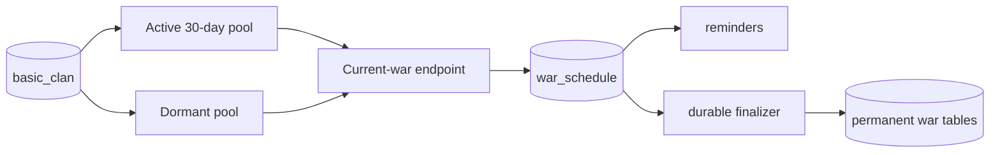

# Global war discovery (`war-discovery`)

## What this process is for

Global war discovery scans public war logs across the game, records an active war once, and performs the durable final fetch when it ends. It works independently of Discord live tracking.

## When it runs

Two continuous discovery loops and one finalizer run inside `war-discovery`:

- Active clans: a war was found within 30 days, using `wars.requests_per_second`.
- Dormant clans: no known war within 30 days, using `wars.dormant_requests_per_second`.
- Due schedules: every 15 seconds, load wars whose `next_run_at` has arrived.

A periodic cleanup removes expired `player_timers`.

## How a clan becomes a target

Both pools require `basic_clan.public_war_log = true`. They are separated by `basic_clan.last_war_at`. A clan is excluded while either side of one of its wars is already in `war_schedule`; this avoids repeatedly polling both perspectives of an active war.

Finding a war updates `last_war_at`, which naturally promotes a dormant clan into the active pool.

## Discovery decision flow

```text
Load next active or dormant clan page
  -> GET current war
  -> no war/private/not found? skip normally
  -> usable active war? compute canonical identity
  -> upsert war_schedule and player_timers
  -> publish war_schedule for reminder reconciliation
```

The canonical schedule key is a hash of the two alphabetically sorted clan tags and the original preparation start time. The viewpoint used to discover the war cannot change its identity.

## Final-war decision flow

```text
war_schedule.next_run_at is due
  -> fetch by regular clan endpoint or CWL war tag
  -> API still says active? move next_run_at one minute forward
  -> ended? store permanent war, members, attacks, and missed attacks
  -> delete completed schedule and its reminder jobs
```

Pseudocode:

```text
for schedule in due_schedules:
  final = fetch_current_war(schedule)
  if final is not ended:
    reschedule(now + 1 minute)
  else:
    transaction:
      insert canonical war and attack data
      remove schedule
```

## Clash API used

- `GET /v1/clans/{clanTag}/currentwar` for regular/friendly discovery and completion.
- `GET /v1/clanwarleagues/wars/{warTag}` for a scheduled CWL final fetch.

## Data read and written

Reads `basic_clan`, `war_schedule`, and due player timers. Writes:

- `war_schedule`: temporary durable active-war clock and opponent mapping.
- `player_timers`: one `(player, war, schedule key)` participation row.
- Permanent war index, member, attack, and missed-attack tables after completion.
- `basic_clan.last_war_at` when a war is observed.

It never writes `basic_player`.

## Events and interaction

It publishes `war_schedule` after the schedule transaction commits. `reminders` uses this to create required clock rows. `trackedclans` can upsert the same schedule earlier for configured clans. The permanent finalizer is shared by any canonical schedule regardless of which process first found it.



## Configuration

- `wars.requests_per_second` (default supplied: 500)
- `wars.dormant_requests_per_second` (default supplied: 50)
- `wars.cwl_sync_seconds` is consumed by the separate CWL mode
- `target_page_multiplier`, SQL, event stream, and proxy settings

## Outages and restarts

Discovery waits at the availability gate. `war_schedule` is PostgreSQL-backed, so active clocks survive restarts without rebuilding an in-memory job list. During official Clash maintenance, `end_time`, `next_run_at`, related player expiry, and reminder run times are shifted together. A proxy-only outage pauses but does not shift game time.

## What it deliberately does not do

- No live Discord attack/state event production.
- No clan member or player profile updates.
- No duplicate schedule for the opposing viewpoint.
- No in-memory final-war job registry.
