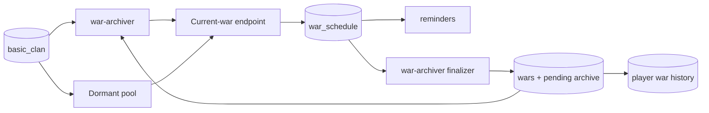

# Global war discovery (`war-discovery`)

## What this process is for

Global war discovery scans public war logs across the game and records an active war once. The separate `war-archiver` process owns the durable final fetch when it ends.

## When it runs

Two continuous discovery loops run inside `war-discovery`:

- Active clans: a war was found within 30 days, using `war_discovery.active_requests_per_second`.
- Dormant clans: no known war within 30 days, using `war_discovery.dormant_requests_per_second`.

A periodic cleanup removes expired `player_timers`.

## How a clan becomes a target

Both pools require `basic_clan.public_war_log = true`. They are separated by `basic_clan.last_war_at`. A clan is excluded while either side of one of its wars is already in `war_schedule`; this avoids repeatedly polling both perspectives of an active war.

Finding a war updates `last_war_at`, which naturally promotes a dormant clan into the active pool.

New regular-war discovery only schedules `preparation` or `inWar` responses with valid identities and an end time strictly in the future. It ignores ended, past-end, and `notInWar` responses so stale API results cannot recreate schedules that the finalizer already removed. Existing scheduled wars still finish normally; CWL tagged-war catch-up is separate and still stores past completed rounds.

## Discovery decision flow

```text
Load next active or dormant clan page
  -> GET current war
  -> no war/private/not found? skip normally
  -> usable active war? compute canonical identity
  -> upsert war_schedule and player_timers
  -> publish war_schedule for reminder reconciliation
```

The canonical schedule key is a hash of the two alphabetically sorted clan tags and the original preparation start time. The viewpoint used to discover the war cannot change its identity.

## Clash API used

- `GET /v1/clans/{clanTag}/currentwar` for regular/friendly discovery and completion.
- `GET /v1/clanwarleagues/wars/{warTag}` for a scheduled CWL final fetch.

## Data read and written

Reads `basic_clan`, `war_schedule`, and due player timers. Writes:

- `war_schedule`: temporary durable active-war clock and opponent mapping.
- `player_timers`: one `(player, war, schedule key)` participation row.
- `wars`: searchable metadata and, after archiving, the exact R2 byte locator.
- `war_archive_pending`: the full compact war payload until a 10,000-war pack is uploaded.
- `player_war_history`: one compact integer array per participant, including players who did not attack.
- `basic_clan.last_war_at` when a war is observed.

It never writes `basic_player`.

## Events and interaction

It publishes `war_schedule` after the schedule transaction commits. `reminders` uses this to create required clock rows. `trackedclans` can upsert the same schedule earlier for configured clans. The permanent finalizer is shared by any canonical schedule regardless of which process first found it.



## Configuration

- `war_discovery.active_requests_per_second` (default supplied: 500)
- `war_discovery.dormant_requests_per_second` (default supplied: 50)
- `target_page_multiplier`, SQL, event stream, and proxy settings

CWL has its own process and its own `cwl.*` budget. The `war-archiver` finalizer has a separate request budget, so final storage does not consume either discovery allowance.

Operational metrics expose `war-discovery.active` and `war-discovery.dormant` as separate finite target pools. Their target totals are recounted every 15 minutes and their processed counts advance with each attempted clan. Finalization metrics belong to `war-archiver.finalization`.

## Outages and restarts

Discovery waits at the availability gate. `war_schedule` is PostgreSQL-backed, so the independent archiver can keep finalizing existing clocks while `war-discovery` or `cwl` restarts. During official Clash maintenance, `end_time`, `next_run_at`, related player expiry, and reminder run times are shifted together. A proxy-only outage pauses but does not shift game time.

Finalization behavior is documented with the `war-archiver` process.

## What it deliberately does not do

- No live Discord attack/state event production.
- No clan member or player profile updates.
- No duplicate schedule for the opposing viewpoint.
- No in-memory final-war job registry.
